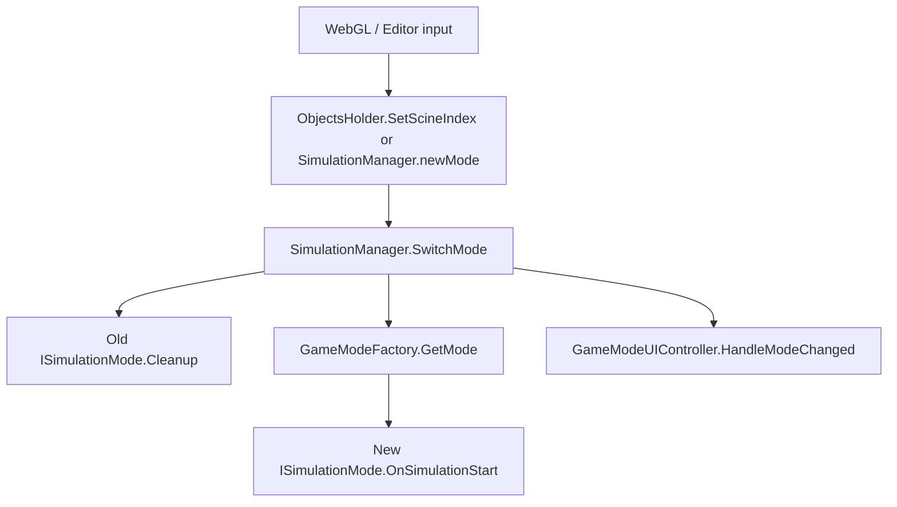
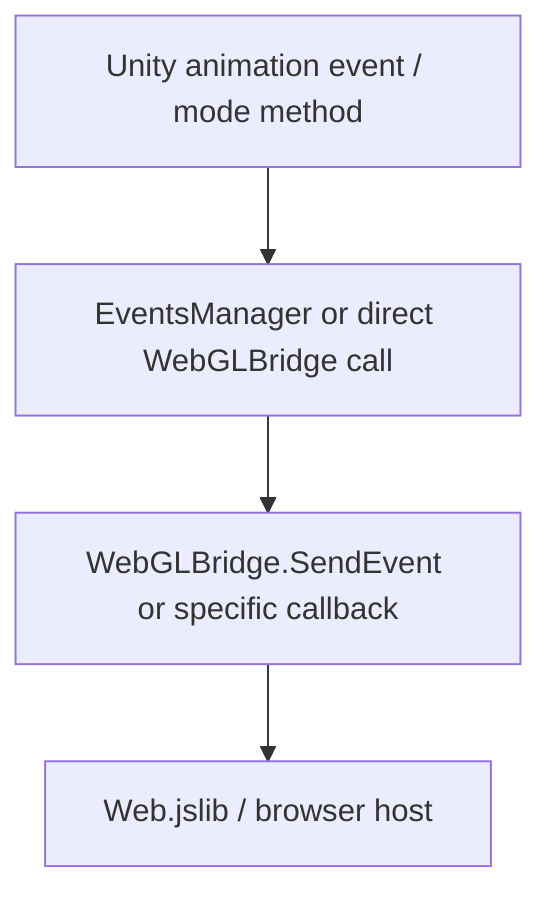

# Hurricane Project Architecture

_Snapshot date: 2026-07-11_

This document describes the structure that exists in the current Unity project checkout. It is an inventory and architecture map, not a refactor plan.

## Project Overview

The project is a Unity 6000.3.3f1 2D/WebGL-oriented simulation about hurricane preparedness. The runtime architecture is centered around a single active Unity scene and a mode-based simulation flow. External web code can drive the simulation through public MonoBehaviour methods and a WebGL JavaScript bridge.

The core gameplay/simulation loop is:

1. Web page or Unity editor input selects a simulation state or scene index.
2. `ObjectsHolder` or `SimulationManager` switches the active `ModeName`.
3. `SimulationManager` activates one `ISimulationMode` implementation.
4. The active mode triggers scene objects, animator states, timers, queues, and WebGL callbacks.
5. Animation-event helper scripts report completed actions back to WebGL through `EventsManager` or `WebGLBridge`.

## Unity Project Structure

### Root

| Path | Purpose |
| --- | --- |
| `Assets/` | Authored Unity content: scripts, scenes, sprites, animations, audio, prefabs, URP settings, TextMesh Pro resources. |
| `Packages/` | Unity package manifest and package lock. |
| `ProjectSettings/` | Unity editor, render pipeline, input, quality, physics, audio, and build settings. |
| `Library/`, `Temp/`, `Logs/`, `obj/`, `.vs/` | Generated/editor cache folders. These are not authored gameplay architecture. |
| `Assembly-CSharp.csproj`, `Hurricane.sln`, `Hurricane.slnx` | Generated IDE/project files for C# editing. |

### Unity Version And Packages

| Item | Current value |
| --- | --- |
| Unity version | `6000.3.3f1` |
| Render pipeline | Universal Render Pipeline `17.3.0` |
| Main feature set | Unity 2D feature package, UGUI, Timeline, Visual Scripting, TextMesh Pro resources |
| Web target support | Project contains `Assets/Plugins/Web.jslib` and `WebGLBridge` P/Invoke bindings |

### Scenes

| Scene | Role |
| --- | --- |
| `Assets/Scenes/SampleScene.unity` | Main enabled build scene. This is the primary runtime scene in `EditorBuildSettings.asset`. |
| `Assets/Scenes/New Scene.unity` | Additional scene asset, not enabled in build settings. |
| `Assets/Settings/Scenes/URP2DSceneTemplate.unity` | URP 2D scene template. |
| `Assets/_Recovery/0.unity`, `Assets/_Recovery/0 (1).unity` | Unity recovery scenes. These should be treated as editor recovery artifacts unless explicitly promoted. |

## Asset Folder Map

| Folder | Current role |
| --- | --- |
| `Assets/Animations/` | Shared animation clips/controllers for house, parents, calendar, radio, children room, garden, supermarket, TV, and hurricane sequences. |
| `Assets/BG/` | Background art for neighborhood, house, road, supermarket arrival, and other scene backgrounds. |
| `Assets/Materials/` | A small set of materials used by sprites/effects. |
| `Assets/Mission 8/` | New/unfinished mission-specific image assets such as background, branches, bottles, glass, lightpost, and trees. |
| `Assets/Panic/` | Panic alert image sequence and animation/controller. |
| `Assets/Plugins/` | WebGL JavaScript library integration (`Web.jslib`). |
| `Assets/prefabs/` | Leaf animation/effect prefabs. |
| `Assets/Resources/` | Empty authored resources folder. |
| `Assets/Scenes/` | Main Unity scene assets. |
| `Assets/Scripts/` | Runtime C# scripts. This is the core architecture folder. |
| `Assets/Settings/` | URP 2D renderer, global URP asset, and scene template settings. |
| `Assets/Shelter/` | Shelter-specific sprites, animation clips, and controllers. |
| `Assets/sounds/` | Audio clips for music, radio broadcast, and samples. |
| `Assets/Sprites/` | Largest content folder. Contains mission art, character rigs, item sprites, sprite atlases, and many animation frame sequences. |
| `Assets/TextMesh Pro/` | TMP package resources, shaders, fonts, sprite assets, and settings. |
| `Assets/_Recovery/` | Unity auto-recovery scene files. |

Approximate authored asset counts at scan time:

| Type | Count |
| --- | ---: |
| `.png` | 562 |
| `.anim` | 85 |
| `.controller` | 36 |
| `.cs` | 29 |
| `.asset` | 9 |
| `.spriteatlasv2` | 6 |
| `.unity` | 5 |
| `.mat` | 4 |
| `.prefab` | 2 |
| Audio files (`.wav`, `.mp3`) | 3 |

## Runtime Architecture

### Central Managers

#### `SimulationManager`

Path: `Assets/Scripts/SimulationManager.cs`

`SimulationManager` is the main runtime coordinator. It inherits from `Singelton<SimulationManager>` and owns the active simulation mode.

Responsibilities:

- Creates a `GameModeFactory`.
- Initializes all known modes from the `ModeName` enum.
- Tracks `CurrentMode` and `PreviousMode`.
- Switches modes through `SwitchMode(ModeName)`.
- Calls `Cleanup()` on the previous mode and `OnSimulationStart()` on the new mode.
- Raises `OnModeChanged` for UI systems.
- Calls WebGL initialization once through `WebGLBridge.CallINITfunction()` and calls `WebGLBridge.OnResetDone()` on scene reset.
- Exposes WebGL-facing methods:
  - `ResetSimulatiom()`
  - `SetSimulationStateInUnity(string state)`

Important behavior:

- In the Unity editor, `Update()` watches the public `newMode` field and switches modes when it changes.
- Runtime mode lookup is component-based: modes are attached to the same GameObject as `SimulationManager`.

#### `GameModeFactory`

Path: `Assets/Scripts/Modes/GameModeFactory.cs`

Maps `ModeName` values to concrete `ISimulationMode` components.

Current map:

| `ModeName` | Component |
| --- | --- |
| `EntryScreen` | `EntryScreenMod` |
| `House` | `HouseMod` |
| `ClearingGarden` | `ClearingGardenMod` |
| `SuperMarket` | `SuperMarketMode` |
| `ChildrenRoom` | `ChildrenRoomMode` |
| `GardenView` | `GardenViewMode` |
| `Shelter` | `ShelterMod` |

If a mode component is missing, the factory adds it dynamically to the target GameObject and calls `Initialize()`.

#### `ISimulationMode`

Path: `Assets/Scripts/ISimulationMode.cs`

Common lifecycle contract for all simulation modes:

- `Initialize()`
- `OnSimulationStart()`
- `OnSimulationEnd()`
- `Cleanup()`

The project currently uses this interface as the main boundary between the simulation coordinator and scene-specific behavior.

#### `ModeName`

Path: `Assets/Scripts/ModeName.cs`

Defines the simulation state enum:

- `EntryScreen`
- `House`
- `ClearingGarden`
- `SuperMarket`
- `ChildrenRoom`
- `GardenView`
- `Shelter`

### WebGL And Event Bridge

#### `WebGLBridge`

Path: `Assets/Scripts/WebGLBridge.cs`

Static bridge between Unity C# and JavaScript in WebGL builds.

In WebGL builds it imports JavaScript functions from `__Internal`:

- `CallINITfunction()`
- `OnResetDone()`
- `SendEvent(string eventName)`
- `OnJuneArrives(int juneID)`
- `OnMayArrives(int mayID)`
- `OnInShelter(int kayID)`
- `HurricaneWatchOnAnnounced(int hurricaneWatchID)`
- `HurricaneWarningOnAnnounced(int hurricaneWarningID)`

Outside WebGL, each function logs a debug message instead of calling JavaScript.

#### `Events` and `EventsManager`

Path: `Assets/Scripts/EventsManager.cs`

`Events` is the string source for outbound WebGL event names. It includes major simulation milestones such as:

- `ReviewEmergencyPlan`
- `RadioBroadcast`
- `CheckGoBag`
- `CleanYard`
- `CollectPlywood`
- `JuneFirst`
- `GoToSupermarket`
- `GetCannedFood`
- `GetWater`
- `GetCrackers`
- `HurricaneWatch`
- `HurricaneWarning`
- `PackClothes`
- `PackToys`
- `PackWater`
- `PackFlashlight`
- `MayArrives`
- `CoverWindow`
- `GetBicycle`
- `GetToys`
- `GetBall`
- `ColorBook`
- `PlayToy`

`EventsManager` exposes public methods that call `WebGLBridge.SendEvent(...)`. These methods are intended for Unity animation events or scene object callbacks.

#### `ObjectsHolder`

Path: `Assets/Scripts/ObjectsHolder.cs`

Singleton-style holder for IDs received from WebGL and for external scene-index control.

Responsibilities:

- Receives and stores IDs:
  - radio
  - June 1
  - May
  - Kay
  - hurricane watch
  - hurricane warning
- Receives scene index from WebGL through `SetScineIndex(int index)`.
- Converts scene indices to simulation modes.
- Applies calendar/timer values to the currently active mode through `SetCalendarTimer(float time)`.

Current scene index map:

| Scene index | Mode |
| ---: | --- |
| `1` | `House` |
| `2` | `ClearingGarden` |
| `4` | `SuperMarket` |
| `5` | `ChildrenRoom` |
| `6` | `GardenView` |
| `7` | `Shelter` |

### UI And Audio

#### `GameModeUIController`

Path: `Assets/Scripts/GameModeUIController.cs`

Listens to `SimulationManager.OnModeChanged` and enables/disables configured GameObjects per mode.

Data structure:

- `ModeUIConfig`
  - `ModeName mode`
  - `List<GameObject> objectsToEnable`

The controller builds a set of all configured objects and only activates the ones assigned to the new mode.

#### `AudioManager`

Path: `Assets/Scripts/AudioManager.cs`

Singleton-style audio service.

Responsibilities:

- Stores `AudioManager.Instance`.
- Controls an `AudioMixer` with exposed parameters:
  - `MasterVolume`
  - `MusicVolume`
  - `SFXVolume`
- Stores volume and mute values in `PlayerPrefs`.
- Plays one-shot SFX and music.
- Toggles a sound settings UI panel from a configured button.
- Pauses/unpauses sound when the simulation state changes.
- Provides special methods for announcement and song playback:
  - `PlayAnnouncement()`
  - `PlaySong()`

#### `AudioSettingsUI`

Path: `Assets/Scripts/AudioSettingsUI.cs`

Connects sliders/toggle UI controls to `AudioManager`:

- Master volume slider
- Music volume slider
- SFX volume slider
- Master mute toggle

#### `ScreenFader`

Path: `Assets/ScreenFader.cs`

Singleton-style screen fade helper using a full-screen `Image`.

Provides:

- `Fade(Action midAction = null)`
- `FadeAsync(Func<Task> midAction = null)`
- `FadeIn()`
- `FadeOut()`

Used by `HouseMod` to transition between visual states.

### Simulation Modes

#### `EntryScreenMod`

Path: `Assets/Scripts/Modes/EntryScreenMod.cs`

Implements `ISimulationMode`, but all lifecycle methods are currently empty. It is a placeholder mode.

#### `HouseMod`

Path: `Assets/Scripts/Modes/HouseMod.cs`

Controls the starting house sequence.

Main responsibilities:

- Starts the house animation with `firstScineAnim.SetTrigger("House")`.
- Runs a calendar timer and triggers June 1 arrival.
- Plays radio announcements and radio song audio.
- Coordinates review plan and go-bag sequences.
- Uses `ScreenFader` for TV watching and parent panic transitions.
- Sends `RadioBroadcast` through `WebGLBridge`.
- Transitions to `ClearingGarden` after TV/go-bag sequences.

Important public WebGL-facing methods:

- `RadioOnAnnouncement()`
- `RadioPlayingSong()`
- `June1onArrivesAnim()`
- `OnReviewPlan()`
- `OnCheckGobag()`
- `WatchTV()`
- `ParentsPanic()`
- `May1onArrivesAnim()`

#### `ClearingGardenMod`

Path: `Assets/Scripts/Modes/ClearingGardenMod.cs`

Controls outdoor preparation actions involving the mom and dad characters.

Architecture:

- Uses a private `Anim` enum:
  - `Walk`
  - `PlyWood`
  - `Cleaning`
  - `Watering`
- Uses an internal `AnimationQueueState` class for independent mom and dad queues.
- Mom animation map:
  - `Cleaning`
  - `Watering`
- Dad animation map:
  - `Walk`
  - `PlyWood`

Public WebGL/editor-facing actions:

- `OnClearYard()`
- `OnGatherPlywood()`
- `GoForWalk()`
- `OnWateringTheFlowers()`

It waits for `OnSimulationStart()` before processing animation coroutines.

#### `SuperMarketMode`

Path: `Assets/Scripts/Modes/SuperMarketMode.cs`

Controls the supermarket trip and item collection sequences.

Enum: `AnimationsInSuper`

- `Tosupermarket`
- `GetCannedFood`
- `GetCrackers`
- `GetWater`
- `GetCheese`
- `GetEggs`
- `GetChicken`
- `GetFish`
- `Announcement`
- `WayToSupermarketAnimation`

Architecture:

- Uses a queue of `AnimationsInSuper`.
- Prevents duplicate queued/current animation.
- Uses a dictionary from enum value to `Action<Action>` animation starters.
- Waits for animator states or timed movement coroutines before completing queued steps.

Main responsibilities:

- Activates car travel/supermarket objects.
- Plays radio announcement in the car.
- Sends `JuneFirst` when its timer expires.
- Sends item events such as `GetWater`, `GetCannedFood`, and `GetCrackers`.
- Moves the mom character to item positions and back to the cart.

Primary WebGL-facing method:

- `SuperQueueAnimation(string animationName)`

#### `ChildrenRoomMode`

Path: `Assets/Scripts/Modes/ChildrenRoomMode.cs`

Controls children room packing and hurricane watch announcement.

Enum: `Animations`

Shared enum currently includes children room and garden actions:

- `KelenTakeTshirt`
- `KelenTakeFruits`
- `KelenTakeFlashlight`
- `KelenTakeLamp`
- `KelenTakeToy`
- `KelenTakeAquarium`
- `KelenTakeWater`
- `KelenTakeScissors`
- `KelenTakeChicken`
- `kelanGoforWalk`
- `kelanTakeBall`
- `kelanTaketoys`
- `keyTakesBicycle`
- `keyPickFlowers`
- `HurricaneWatchAnnouncement`

Architecture:

- Uses a queue of `Animations`.
- Maps supported room animations to callbacks.
- Moves Kelen to room objects, toggles hand-held objects, and returns to the bag.
- Has shared helper coroutines for left-side room items and right-side toy items.
- Starts a looping Kelen play coroutine until hurricane watch interrupts it.

Main WebGL/editor-facing methods:

- `AddAnimationFromWeb(string animationName)`
- `SendHurricaneWatch()`
- item methods such as `KelenTakeWater`, `KelenTakeToy`, `KelenTakeTshirt`

Outbound events include:

- `PackClothes`
- `PackToys`
- `PackWater`
- `PackFlashlight`
- `HurricaneWatch`

#### `GardenViewMode`

Path: `Assets/Scripts/Modes/GardenViewMode.cs`

Controls later garden view actions for mom, Kelan, and Key.

Architecture:

- Uses the shared `Animations` enum.
- Uses separate `AnimationQueueState` instances for Kelan and Key.
- Has separate animation maps:
  - Kelan: `kelanTakeBall`, `kelanGoforWalk`, `kelanTaketoys`
  - Key: `keyPickFlowers`, `keyTakesBicycle`
- Exposes completion `Action` callbacks used by `GardenTakesObjects` to remove held objects.

Main responsibilities:

- Sends hurricane warning announcement callback after timer expiration.
- Plays radio announcement animation.
- Handles mom covering windows and watering garden.
- Handles Kelan taking toys/ball and going for a walk.
- Handles Key taking bicycle and picking flowers.

Primary WebGL-facing methods:

- `AddKelanAnimationFromWeb(string animationName)`
- `AddKeyAnimationFromWeb(string animationName)`
- `SendHurricaneWarning()`
- `HurricaneWarningAnnouncement()`
- `RadioOnAnnouncement()`
- `OnCoversWindow()`
- `OnWaterGarden()`

Note: `Cleanup()` and `OnSimulationEnd()` currently throw `NotImplementedException`.

#### `ShelterMod`

Path: `Assets/Scripts/Modes/ShelterMod.cs`

Controls shelter behavior after the family reaches shelter.

Enum: `ShelterAnimations`

- `ColoursABook`
- `PlaysWithToy`
- `PlaysOutside`
- `TalksToAStranger`

Architecture:

- Uses a queue of `ShelterAnimations`.
- Avoids duplicate queued/current animation.
- Maps each enum value to an animation coroutine.
- Sends shelter-related events back to WebGL.

Main responsibilities:

- Starts a shelter timer.
- Calls `WebGLBridge.OnInShelter(ObjectsHolder.instance.GetKayID())` when the timer expires.
- Plays Kay and stranger/talk animations.
- Sends events:
  - `ColorBook`
  - `PlayToy`

Primary WebGL-facing method:

- `ShelterQueueAnimation(string animationName)`

#### `AfterTheHurricane`

Path: `Assets/Scripts/Modes/AfterTheHurricane.cs`

Currently a plain `MonoBehaviour` with empty `Start()` and `Update()` methods. It is not part of `ModeName` and is not registered in `GameModeFactory`, so it is not an active simulation mode yet.

### Scene Object And Animation Event Helpers

#### `AnimationEvent`

Path: `Assets/Scripts/AnimationEvent.cs`

General animation event receiver.

Responsibilities:

- Changes animator trigger by string.
- Activates planks one by one.
- Sends `CollectPlywood`, `CoverWindow`, `JuneFirst`, and `MayArrives`.
- Calls specific WebGL ID callbacks for June and May.
- Toggles a text canvas.
- Marks `HouseMod.canPlayEmergencyPlan = true` after page/text animation finishes.

#### `LeavsAnimation`

Path: `Assets/Scripts/LeavsAnimation.cs`

Controls a small leaf cleanup effect:

- Disables individual leaf GameObjects.
- Plays a particle system.
- Enables pile-of-leaves GameObjects.

#### `LeavsAnimationEvent`

Path: `Assets/Scripts/LeavsAnimationEvent.cs`

Animation event receiver that advances through multiple `LeavsAnimation` instances and sends `CleanYard`.

#### `GardenTakesObjects`

Path: `Assets/Scripts/GardenTakesObjects.cs`

Maps garden object types to scene objects and hand-held objects.

Enum: `TakesObjectType`

- `Toys`
- `Ball`
- `Bicycle`
- `Flowers`

It sends events for taken objects and subscribes to `GardenViewMode` completion callbacks to remove the held object.

#### `RoomTakesObjects`

Path: `Assets/Scripts/RoomTakesObjects.cs`

Scene reference holder for children room packable objects. `HandleObjectTaken(string objectName)` toggles room objects off and hand objects on.

Supported names:

- `TShirt`
- `Fruits`
- `FlashLight`
- `Lamp`
- `Toy`
- `Aquarium`
- `Water`
- `Scissors`
- `Chickens`

#### `SuperTakesObjects`

Path: `Assets/Scripts/SuperTakesObjects.cs`

Scene reference holder for supermarket cart/hand item swaps.

Supported names:

- `Sardines`
- `Water`
- `Chips`
- `Cheese`
- `Eggs`
- `Chicken`
- `Fish`

#### `CanvasFollow`

Path: `Assets/CanvasFollow.cs`

Simple helper that moves a canvas/object to `target.position + offset` every frame.

#### `ScineSwicher`

Path: `Assets/Scripts/ScineSwicher.cs`

Simple GameObject switch helper. `SwitchToNextObject()` activates `nextObjectToSwitch` and deactivates the current GameObject.

#### `SimulationConfig`

Path: `Assets/Scripts/SimulationConfig.cs`

Separate singleton-style config object with a `SimulationConfigId` property and a WebGL-facing `ResetSimulatiom()` method. The current implementation does not assign `SimulationConfigId`.

### Singleton Structures

The project uses several singleton/static access patterns:

| Type | Pattern |
| --- | --- |
| `Singelton<T>` | Generic MonoBehaviour singleton base used by `SimulationManager`. |
| `SimulationManager.Instance` | Inherited from `Singelton<SimulationManager>`. |
| `AudioManager.Instance` | Manual static field. |
| `ScreenFader.Instance` | Manual static property. |
| `ObjectsHolder.instance` | Manual static field. |
| `SimulationConfig.Instance` | Manual static property. |
| `GardenViewMode.Instance` | Manual static property. |
| `WebGLBridge` | Static bridge class. |

## Current Data And Control Flow

### Mode Switching Flow

### Web Event Flow

### Mode-To-Content Flow

| Mode | Main content controlled |
| --- | --- |
| `House` | House animation, radio, calendar, TV, emergency plan, go-bag, parent panic. |
| `ClearingGarden` | Mom cleaning/watering, dad walking/gathering plywood, leaves/planks events. |
| `SuperMarket` | Car travel, radio announcement, mom item pickup, cart item swaps. |
| `ChildrenRoom` | Kelen item packing, Kay bag sequence, hurricane watch announcement. |
| `GardenView` | Mom garden/window actions, Kelan/Key outdoor object actions, hurricane warning. |
| `Shelter` | Kay shelter animations, stranger/talk interaction, shelter arrival callback. |
| `EntryScreen` | Placeholder only. |

## Current Worktree Notes

At the time this document was created, the working tree already contained modified and untracked files unrelated to this documentation snapshot. Existing changed files included scene/animation/script changes and a new `Assets/Mission 8/` folder plus `Assets/Scripts/Modes/AfterTheHurricane.cs`. This document records the current checkout state and does not modify those files.

## Architectural Observations

This section records notable structural facts from the current implementation.

1. The project already has a useful mode abstraction through `ISimulationMode`, `ModeName`, `GameModeFactory`, and `SimulationManager`.
2. Most gameplay behavior is still scene-reference driven: large mode scripts directly hold many `GameObject`, `Animator`, `Transform`, and timer fields.
3. WebGL integration is spread across `ObjectsHolder`, mode classes, `EventsManager`, and animation-event helpers.
4. Several mode scripts implement their own animation queue pattern. `SuperMarketMode`, `ChildrenRoomMode`, `GardenViewMode`, `ClearingGardenMod`, and `ShelterMod` all contain similar queue/dictionary/callback logic.
5. The project relies heavily on string-based animation triggers and string-based WebGL animation names.
6. Several scripts expose public fields for inspector wiring; others use `[SerializeField]`. The style is mixed.
7. Some names contain typos or inconsistent spelling, such as `Singelton`, `ScineSwicher`, `ResetSimulatiom`, `Leavs`, `weteringFlowers`, `heand`, `Mod`, `Kelen/Kelan/Key/Kay`.
8. `AfterTheHurricane` exists as a script but is not integrated into the mode system.
9. `GardenViewMode.Cleanup()` and `GardenViewMode.OnSimulationEnd()` currently throw `NotImplementedException`, which can break mode switching or destruction if those paths execute.
10. The enabled build scene is only `Assets/Scenes/SampleScene.unity`; other scenes exist but are not part of current build settings.

