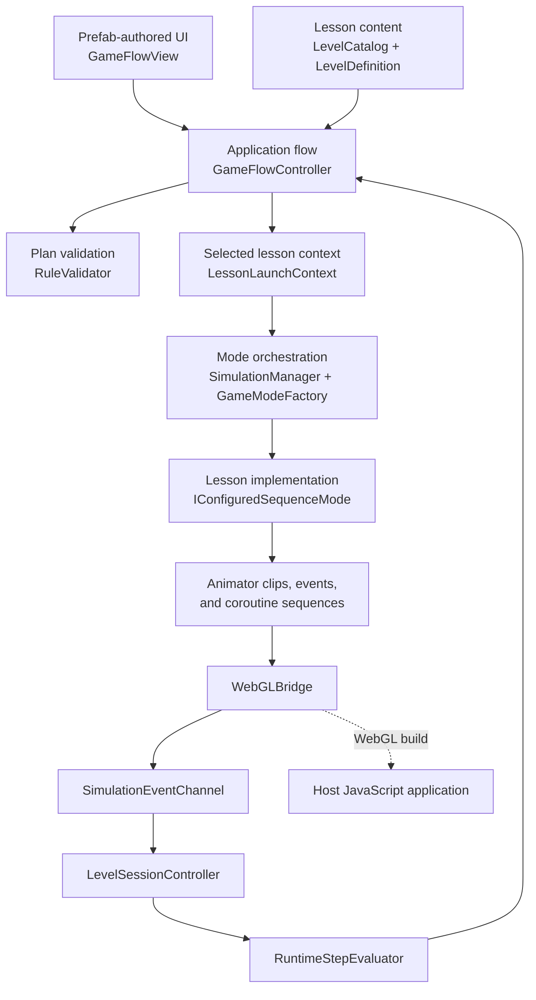

# Hurricane Emergency Simulation


An interactive 2D learning experience that teaches hurricane preparedness through decision-making and visual simulation. Players choose a lesson, build an ordered action plan from correct choices and realistic distractors, and then watch the family carry out that plan in an animated scene.

The project turns safety guidance into active practice: learners must decide what to do, understand which actions are alternatives, arrange the correct sequence, and see immediate feedback when an action is missing, incorrect, duplicated, or out of order.

## Project highlights

- Ten hurricane-preparedness lessons covering the home, supplies, shelter, outdoor areas, and post-storm cleanup.
- A rule-building interface with explicit either/or choices, lesson-specific ordering rules, and distractors.
- Animated simulations driven by the player's selected plan.
- Runtime assessment that validates selected rules and enforces event order only when the lesson requires it.
- Independent simulation modes behind a shared interface, allowing lessons to reuse one application flow.
- ScriptableObject-based lesson content that separates educational data from presentation and animation logic.
- Responsive prefab-authored UI with high-contrast styling, live progress feedback, completion states, and a success celebration.
- A JavaScript bridge for embedding the Unity experience in a larger WebGL application.
- Edit Mode tests for rule validation, event sequencing, lesson data, and mutually exclusive choices.

## Learning flow

1. Select a hurricane-preparedness lesson.
2. Read the briefing and objective.
3. Choose one action from each correct/distractor pair.
4. Arrange the selected actions when the lesson requires a specific sequence.
5. Launch the simulation and watch the characters execute the plan.
6. Receive live feedback and a final success or failure result.

## Included lessons

| Lesson | Learning objective |
| --- | --- |
| House | Follow official information, review the family plan, and check the Go Bag. |
| Cleaning Garden | Remove loose debris and gather plywood before strong winds arrive. |
| Supermarket | Choose shelf-stable food and drinking water for an emergency. |
| Children Room | Pack useful clothing, water, a flashlight, and a familiar toy. |
| Garden View | Secure outdoor belongings after a hurricane warning. |
| Shelter | Choose calm, safe activities while staying inside the shelter. |
| After the Hurricane | Perform cleanup actions in a safe planned order. |
| Build a Go Bag | Pack essential items after the family reminder. |
| Kitchen Supplies | Select food and water that can travel safely during an emergency. |
| Bathroom Supplies | Pack hygiene and first-aid essentials in the correct sequence. |

## Technology stack

| Area | Technology |
| --- | --- |
| Engine | Unity 6000.3.3f1 |
| Language | C# |
| Rendering | Universal Render Pipeline 17.3, 2D Renderer |
| UI | Unity UI (`uGUI`), prefab-based views, responsive layout groups |
| Animation | Unity Animator Controllers, Animation Clips, Animation Events, coroutines |
| Content | ScriptableObjects and serialized Unity assets |
| Browser integration | WebGL, WebAssembly, native JavaScript plugin bridge (`.jslib`) |
| Testing | Unity Test Framework 1.6 with NUnit Edit Mode tests |
| Source control | Git and GitHub |

## Architecture

The application uses a layered, event-driven structure. Shared systems own navigation, validation, and feedback, while each lesson mode owns its scene-specific animation sequence.



### Presentation and application flow

`GameFlowController` is the application-level coordinator. It moves the user through the main menu, briefing, rule builder, live simulation, and result states. `GameFlowView` holds serialized references to the UI hierarchy and reusable view prefabs. Runtime code instantiates only repeatable content such as lesson cards and rule rows; the screen structure remains authored in the prefab.

### Data-driven lesson model

`LevelCatalog` contains the available `LevelDefinition` assets. Each definition stores the title, briefing, objective, simulation mode, required actions, and distractors. At runtime, these assets produce `RuleDefinition` objects and the expected event sequence. This keeps lesson content editable without putting educational copy or rule lists inside the UI controller.

### Rule and event validation

The project validates the experience at two points:

- `RuleValidator` compares the player's selected rule IDs with the lesson plan and applies the lesson's ordering policy before the simulation begins.
- `RuntimeStepEvaluator` checks the events emitted by the simulation, supports ordered and completion-based lessons, and distinguishes correct, incorrect, out-of-order, duplicate, and completed states.

`LevelSessionController` subscribes to `SimulationEventChannel` only for the active mode. This prevents events from unrelated scene systems from affecting the current lesson.

### Simulation modes

`SimulationManager` switches between implementations of `ISimulationMode`. `GameModeFactory` maps each `ModeName` to its concrete component, while `IConfiguredSequenceMode` provides a common entry point for lessons driven by the rule builder.

Each mode translates generic lesson commands into its own animations and timing. Shared queue utilities support sequential actions, while a mode can coordinate parallel character animations when the scene requires it. This keeps character-specific behavior out of the main application controller.

### Animation and WebGL integration

Animator Controllers and Animation Events report meaningful actions such as packing an item or collecting plywood. `WebGLBridge` forwards the same event to the internal C# event channel and, in a WebGL player, to the JavaScript host through `Assets/Plugins/Web.jslib`. Editor and standalone execution use safe C# fallbacks, so the simulation can still be developed without a browser host.

## Repository structure

```text
Hurricane-Emergency-Simulation/
├── README.md
└── Hurricane-Emergency/
    ├── Assets/
    │   ├── Data/Lessons/       # ScriptableObject lesson catalog and definitions
    │   ├── Editor/             # Lesson/UI authoring and maintenance tools
    │   ├── Plugins/            # WebGL JavaScript bridge
    │   ├── prefabs/GameFlow/   # Main UI and reusable view prefabs
    │   ├── Scenes/             # Main menu and simulation scenes
    │   ├── Scripts/
    │   │   ├── Animation/      # Reusable motion and animation queue helpers
    │   │   ├── Events/         # Internal simulation event channel
    │   │   ├── Flow/           # Navigation, session state, views, runtime evaluation
    │   │   ├── Levels/         # Lesson and rule data models
    │   │   ├── Modes/          # Scenario-specific simulation implementations
    │   │   └── Rules/          # Ordered-plan validation
    │   └── Tests/Editor/       # Edit Mode rule-system tests
    ├── Packages/               # Unity package manifest and lock file
    └── ProjectSettings/        # Engine, rendering, and build configuration
```

## Design decisions

- **One shared flow, multiple scenarios.** Lessons use the same navigation and assessment pipeline while keeping animation details inside their respective modes.
- **Content outside controllers.** Lesson objectives and rule sets live in assets rather than large conditional blocks.
- **Events as the assessment boundary.** The evaluator responds to completed simulation actions instead of relying only on button selections or approximate timers.
- **Explicit serialized UI references.** The main interface is visible and editable in the Unity hierarchy, making layout work predictable for designers.
- **WebGL as an integration layer.** Browser communication is isolated behind one bridge and does not spread JavaScript-specific checks across gameplay code.

## Getting started

### Requirements

- Unity Hub
- Unity Editor `6000.3.3f1`
- Git

### Open the project

1. Clone the repository:

   ```bash
   git clone https://github.com/kirillmakarov-dev/Hurricane-Emergency-Simulation.git
   ```

2. In Unity Hub, choose **Add project from disk**.
3. Select the `Hurricane-Emergency` directory inside the cloned repository.
4. Open `Assets/Scenes/MainMenu.unity` and enter Play Mode.

The build scene list contains:

1. `Assets/Scenes/MainMenu.unity`
2. `Assets/Scenes/SampleScene.unity`

### Run tests

Open **Window → General → Test Runner**, select **EditMode**, and run the tests in `Assets/Tests/Editor/RuleSystemTests.cs`.

### Create a WebGL build

1. Open **File → Build Profiles**.
2. Select or add the **Web** platform.
3. Confirm that `MainMenu` and `SampleScene` are enabled in the scene list.
4. Build the player and serve the output through a local web server or the intended host application.

The JavaScript callbacks in `Assets/Plugins/Web.jslib` expect the embedding page to provide the corresponding functions on its `globals` object. This integration is only required when the build is embedded in that host environment.

## Portfolio context

This repository demonstrates the design and implementation of a complete educational interaction loop rather than a collection of disconnected scenes. The central engineering challenge was to connect content authoring, user-selected rules, character animation, runtime event validation, responsive UI, and WebGL communication without coupling every lesson to one large controller.

The result is an extensible Unity learning prototype in which new scenarios can follow the same contract: define lesson data, implement a simulation mode, map commands to animations, and emit assessment events through the shared channel.
